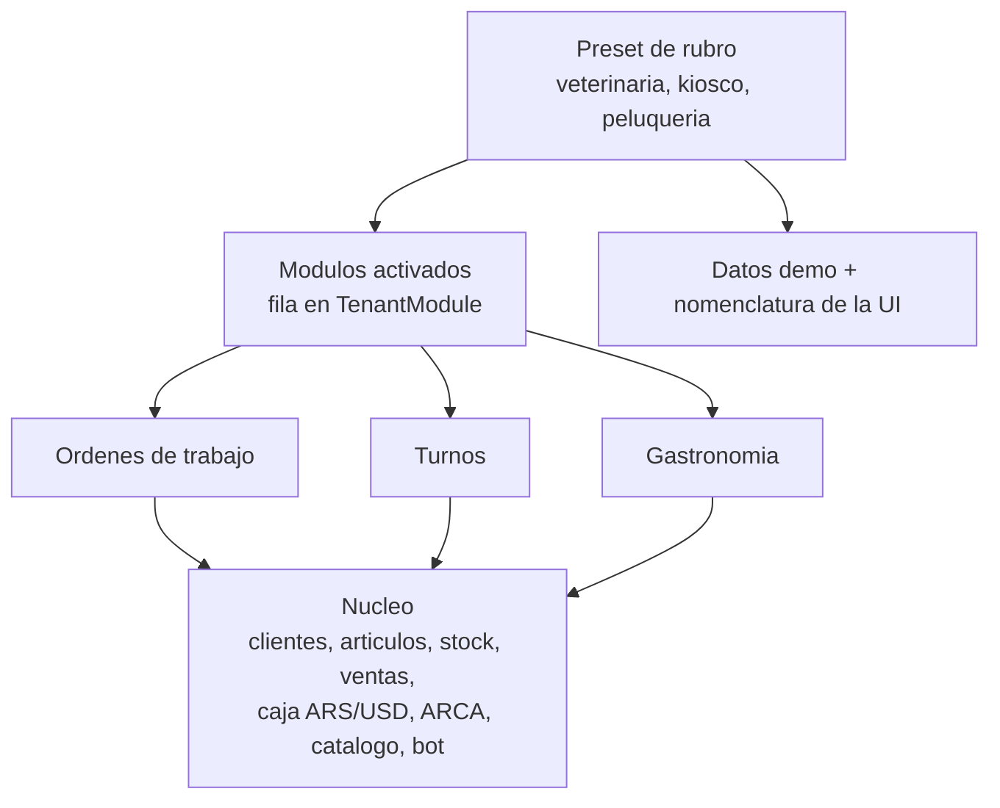
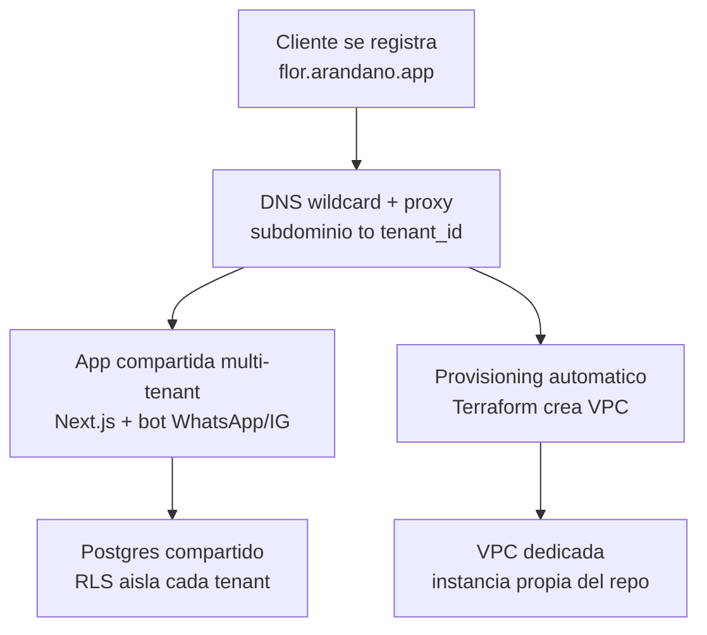

# Arándano — contexto del proyecto

Este documento resume las decisiones de producto y arquitectura ya tomadas para Arándano, de forma que cualquier trabajo futuro (incluido Claude Code) parta de este contexto en vez de re-discutir decisiones ya cerradas.

## Qué es Arándano

Plataforma de gestión para cualquier tipo de negocio del mercado argentino. Conecta en un solo lugar: ventas, stock/inventario, caja en pesos y dólares, clientes, facturación ARCA, catálogo público y un bot de WhatsApp/Instagram conectado a los datos reales del negocio (stock, precios, seguimiento de ventas frías, pedido de reseñas).

Sobre esa base, cada rubro suma lo suyo: órdenes de trabajo para servicio técnico y oficios, agenda para servicios con turno, mesas y comandas para gastronomía. El primer vertical que se implementa es locales de celulares, tecnología y servicio técnico — es el mercado que ya está validado —, pero el sistema se diseña desde el inicio para el resto.

Planes comerciales: Básico, Negocio, Profesional (más elegido, incluye bot) y Premium (a medida, infraestructura dedicada).

## Arquitectura de producto: núcleo, módulos y presets de rubro

La plataforma sirve a cualquier rubro sin convertirse en un genérico configurable. Se apoya en tres piezas.

**Núcleo.** Lo que todo negocio necesita y no cambia de rubro a rubro: tenant, usuarios y roles, clientes, catálogo de artículos (productos con stock y servicios sin stock), inventario, ventas, caja en pesos y dólares, facturación ARCA, catálogo público, bot y jobs en background. El núcleo solo, sin activar ningún módulo, ya cubre un comercio de retail completo (kiosco, ropa, ferretería, dietética, pet shop).

**Módulos.** Código que agrega comportamiento nuevo, activable por tenant. Son pocos, y eso es deliberado:

| Módulo | Qué agrega | Rubros que habilita |
|---|---|---|
| **Órdenes de trabajo** | Ciclo ingreso → diagnóstico → presupuesto → aprobación del cliente → ejecución con repuestos → cierre y cobro | Servicio técnico, celulares, electricista, plomero, refrigeración, obra chica |
| **Turnos** | Agenda, disponibilidad, recursos y profesionales asignados, reserva y recordatorio automático | Peluquería, estética, consultorio, taller mecánico, veterinaria |
| **Gastronomía** | Mesas, comandas, pantalla de cocina, recetas que descuentan insumos | Bar, cafetería, restó, delivery |

**Presets de rubro.** Un rubro no es código: es un archivo de configuración que declara qué módulos vienen activados, qué datos demo se cargan y cómo se nombran las cosas en la UI. Agregar "veterinaria" (núcleo + turnos) o "dietética" (sólo núcleo) no requiere desarrollo. Por eso la promesa de "cualquier tipo de negocio" es sostenible: los rubros son ilimitados, los módulos son tres.

Decisiones asociadas, ya cerradas:

- **Un tenant activa varios módulos, no uno.** El propio local de celulares es núcleo + órdenes de trabajo; una veterinaria es núcleo + turnos. El modelo nunca asume un único rubro por tenant.
- **Reparaciones y oficios son el mismo módulo.** Un service de celulares y un electricista comparten el mismo ciclo de trabajo; la diferencia (mostrador vs. domicilio, equipo con IMEI o sin él) son campos y estados del preset, no un módulo aparte.
- **Los módulos no se cobran aparte ni se atan al plan.** Cualquier tenant activa lo que necesite; el plan limita capacidad y features transversales (usuarios, sucursales, bot, ARCA, reportes). Un consultorio chico no debe subir de plan sólo para tener agenda.
- **Mecanismo: monolito modular con registry.** Cada módulo vive en `modules/<nombre>/` con su schema de Prisma, rutas, UI y jobs, más un `module.ts` que declara qué aporta. La activación es una fila en `TenantModule`. Un solo repo y un solo deploy, coherente con el VPS único y el Docker Compose ya elegidos.

El núcleo expone puntos de extensión explícitos, y los módulos sólo pueden engancharse ahí: navegación, tipos de artículo, generación de ventas (`crearVentaDesde`), movimientos de stock, intents del bot, jobs de pg-boss, vistas del catálogo público y datos demo de onboarding. Un módulo que necesite algo fuera de esa lista es señal de que falta un punto de extensión en el núcleo — no de que haya que saltearlo.

## Modelo SaaS y multi-tenancy

- Cada cliente (el negocio, sea del rubro que sea) es un **tenant**, identificado por subdominio: `flor.arandano.app`.
- La mayoría de los planes (trial, Básico, Negocio, Profesional) **comparten una única aplicación y una única base de datos Postgres**, aislados lógicamente por columna `tenant_id` + Row Level Security. El registro de un cliente nuevo es instantáneo: crear fila de tenant + datos demo, sin tocar infraestructura.
- El plan **Premium** es la excepción: dispara un flujo de *provisioning* automatizado (Terraform) que levanta una instancia con **VPC dedicada** para ese cliente. Este es un upsell consciente, no el default.
- Un tenant que crece y necesita aislarse más adelante se migra de "fila en Postgres compartido" a "VPC dedicada" — tenerlo en cuenta en el diseño del modelo de datos para que exportar/migrar un tenant sea limpio (ya prometemos 30 días de exportación de datos al cliente).

## Stack tecnológico elegido

| Pieza | Elección | Motivo |
|---|---|---|
| Framework full-stack | **Next.js (App Router) + TypeScript** | Un solo lenguaje front/back, ecosistema React rico para dashboards, corre como servidor Node propio (no serverless) para sostener websockets |
| Componentes de UI | **shadcn/ui** sobre Tailwind | Se copian al repo en vez de instalarse como dependencia: el código es nuestro y se puede modificar sin pelearle a la librería. Accesibilidad y teclado ya resueltos por Radix, que es lo que más cuesta hacer bien en una pantalla de venta que se opera sin mouse |
| Base de datos | **PostgreSQL** | Estándar, soporta RLS nativo para el aislamiento por tenant |
| ORM | **Prisma** | Mejor DX y documentación del ecosistema Node; Prisma Studio sirve como ventana rápida de debug |
| Autenticación | **Better Auth** | Auth.js no maneja contraseñas en serio (su plugin de credentials es un ejemplo de referencia, no producción) — apuesta a proveedores OAuth o a magic link por mail. Un magic link en el mostrador de un local significa que el empleado tiene que abrir su mail para entrar y cobrar, así que el requisito real es usuario y contraseña, y ahí Better Auth es la opción madura del ecosistema Node |
| Multi-tenancy (app) | **Helper de servidor** (`lib/tenant/desde-request.ts`) resuelve subdominio → tenant leyendo el `Host`; extensión de Prisma fuerza filtro por `tenant_id` | Sin `middleware.ts`: el middleware de Next no puede consultar Postgres, así que tendría que pasarle el resultado a la app por un header — y un header del que la app deduce qué tenant servir es superficie de suplantación que no compra nada, porque el `Host` la app ya lo lee directo |
| Multi-tenancy (datos) | **Row Level Security de Postgres** como segunda capa de defensa | Si algún query se olvida el filtro, la base igual protege el dato |
| Modularidad por rubro | **Monolito modular**: `modules/<nombre>/` con schema, rutas, UI y jobs propios, más un registry; activación por fila en `TenantModule` | Un rubro nuevo no toca infraestructura ni suma un deploy; las tablas de cada módulo viven en el mismo Postgres y heredan el mismo RLS |
| Colas / background jobs | **pg-boss** (cola sobre el mismo Postgres) | Evita sumar Redis desde el día uno; cubre seguimientos automáticos y pedido de reseñas |
| Tiempo real (bandeja del bot) | **Socket.io / ws** sobre el servidor Node custom | Posible porque el deploy es un VPS propio, no serverless |
| Integración WhatsApp / Instagram | **Meta Cloud API oficial** (Tech Provider), llamada HTTP directa | Vía oficial, evita riesgo de baneo de número |
| Facturación ARCA | **afip.js**, aislado detrás de una interfaz propia (`billing/emitirFactura()`) | Es la opción disponible en Node pero menos madura que el equivalente Python (pyafipws); aislarla permite reemplazarla por un microservicio si falla en producción |
| Reverse proxy / TLS | **Caddy** con certificado wildcard `*.arandano.app` vía DNS-01 | TLS automático sin gestionar certificados a mano |
| Servidor | **1 VPS en Hetzner** — `ngfacil-ubuntu-8gb-ash-1`, 2 vCPU / 8 GB, Ubuntu 26.04, Ashburn (`178.156.251.41`) | Suficiente para cientos de tenants con este volumen de uso; no se justifica multi-servidor todavía. Con sólo 2 vCPU, los límites de recursos entre dev y prod son obligatorios (ver *Entorno de trabajo*) |
| Acceso a entornos internos | **Tailscale** (ya instalado y en uso) | Permite exponer el stack de desarrollo sin abrirlo a internet: dev escucha únicamente en la IP de Tailscale del servidor |
| Orquestación | **Docker Compose** (Next.js + Postgres + Caddy) | Simplicidad operativa para un solo servidor |
| Backups | **pg_dump nocturno** a Hetzner Object Storage / Backblaze B2 | Barato y cubre la promesa de exportación de datos a 30 días |

## Entorno de trabajo: dev y producción en el mismo servidor

El desarrollo ocurre sobre el mismo VPS que sirve a los clientes, y así va a quedar — no hay una segunda máquina prevista. Como no existe nada que absorba un error, la separación entre entornos tiene que ser **estructural**, no depender del cuidado de quien escribe.

**Producción no es un directorio donde se edita: es una imagen que se corre.**

- `/root/arandano` es el workspace de desarrollo. Es el repo, y ahí se rompe lo que haga falta.
- `/srv/arandano/prod/` contiene sólo `docker-compose.yml`, `.env` y los volúmenes. **Sin código fuente.** Corre una imagen Docker tageada con el SHA de git.
- El único camino para cambiar producción es un deploy. Nunca un editor ni un `next dev` sobre lo que un cliente está usando.

**Aislamiento de los tres stacks.** Tres proyectos Compose con nombres distintos (`arandano-prod`, `arandano-dev`, `arandano-stage`), cada uno con su red, sus volúmenes y su base de datos. Un `docker compose down -v` en dev es incapaz de tocar los datos de producción. Dev y stage escuchan únicamente en la IP de Tailscale del servidor (`100.64.81.63`), así que no existen desde internet; prod escucha en 80/443 detrás de Caddy.

**Convivencia sobre 2 vCPU.** Los límites de recursos son la única defensa que hay, así que no son opcionales:

- Límites de CPU y memoria por contenedor en los tres stacks: dev y stage capados a un core, prod con el suyo reservado.
- Swap configurada — el servidor viene sin ella. Sin swap, un OOM durante un build deja que el kernel elija víctima, y puede ser Postgres.
- `oom_score_adj` negativo en el contenedor de Postgres de producción, para que sea el último candidato del OOM killer.
- Rotación de logs de Docker (`max-size` / `max-file`) en los tres stacks, para que dev no pueda llenar el disco.
- **Los builds corren dentro del slice de systemd `arandanobuild.slice` (2 GiB, un core), más `--resource` por contenedor de `RUN`**, y ese comando concreto importa: `nice` y `docker build --cpuset-cpus=… --memory=…` **no hacen absolutamente nada** sobre esta máquina y no avisan que no lo hacen. El detalle y la prueba están en `docs/runbook-stacks.md`; `scripts/verify-infra.sh build` lo comprueba contra un build real.
- **`arandano-dev` se frena antes de que arranque el build**, no antes de stage. Es lo único que hace cerrar la aritmética: prod (3200 MiB) + dev (2304) + el build (2048) + ~1.1 GB de sistema ≈ 8.5 GB sobre una caja de 7.6 GB. Con dev abajo desde el primer paso del deploy, el pico queda en ~7.5 GB — y de paso queda cubierta la regla de que dev y stage no corren juntos, porque stage viene después del build.

**Staging es la promoción del artefacto, no otra máquina.** El deploy buildea la imagen una sola vez, la corre en un tercer stack (`arandano-stage`) contra un Postgres **efímero en tmpfs** —no contra la base de dev, que suele tener trabajo en curso—, le pasa healthcheck y smoke tests, y recién entonces promueve **esa misma imagen** a producción. Nunca se rebuildea para prod: lo que se probó es exactamente lo que se sirve.

El deploy frena `arandano-dev` desde el arranque —antes del build, no antes de stage— y lo vuelve a levantar al terminar. Eso resuelve dos cosas de una: el pico de memoria del build (ver *Convivencia sobre 2 vCPU*) y el hecho de que dev y stage no pueden correr a la vez, porque sus límites de CPU sumados pasarían de un core.

**Migraciones.** Es el riesgo mayor del esquema, por encima de los bugs de código: un bug se arregla en minutos, una migración destructiva se lleva datos de un cliente que no vuelven.

- Dev usa `prisma migrate dev` libremente. Producción usa **sólo `prisma migrate deploy`**; `migrate reset` y `db push` quedan bloqueados por el script de deploy.
- **Expand/contract**: ninguna columna se borra ni se renombra en el mismo deploy que deja de usarla. Primero se deploya el código que no la usa, y el drop viene en un deploy posterior. Es lo que mantiene el rollback siempre posible.
- `pg_dump` inmediatamente antes de cada migración, además del backup nocturno.

**El deploy es un comando con gate.** `deploy.sh` encadena: `BETTER_AUTH_SECRET` presente en el `.env` del objetivo (junto con el token del healthcheck, lo primero que se resuelve, antes de tocar nada — sin este chequeo el resto del gate no lo detecta: el healthcheck no mira autenticación y los smoke tests corren contra `arandano-stage`, que lleva el secreto inline en su compose y no en un `.env`; faltar la variable en producción hubiera dejado el gate entero en verde con toda página de tenant en 500, hallazgo de la review de Task 11) → working tree limpio → migraciones no destructivas → schema sincronizado con las migraciones (y, contra prod, el `Caddyfile` de `/srv/arandano/prod` idéntico al del repo — al rutear el gate por `localhost:443` el proxy perdió la cobertura *accidental* que tenía cuando el healthcheck entraba por el `:80`, y esa comparación más la del `308` de más abajo son lo único que la reemplaza) → tests → typecheck → frenar `arandano-dev` → build tageado → ensayo de la migración contra `arandano-stage` → smoke tests contra `arandano-stage` → `migrate status` contra prod, en las dos direcciones → backup → `migrate deploy` → `setup-db-roles.sh` contra el objetivo (el `EXECUTE` de las funciones se otorga por nombre, no por default privilege, así que esta corrida post-migración es la que lo aplica — Task 5c) → alta del tenant canario contra el objetivo, tolerando que ya exista (Task 6: el check de tenant del healthcheck necesita un canario al que apuntar, y sin este paso sólo existía contra la base efímera de stage) → promoción de la imagen (`--no-deps`) → healthcheck con comparación de SHA, más —contra prod— la comprobación de que el `:80` sigue devolviendo `308` y no la app (el archivo puede coincidir y Caddy seguir sirviendo la config vieja: `cp` sin `reload`) → tag de git pusheado a `origin`, con rollback automático a la imagen anterior si falla la promoción o el healthcheck. El chequeo de schema va temprano, en el preflight, y no después del build: corre con el `npx prisma` del propio repo, así que no necesita ninguna imagen construida todavía. El ensayo en stage va **antes** de tocar producción: la migración se prueba sobre una base virgen antes que sobre la de clientes. Corrido con `--objetivo=ensayo` (`docs/runbook-stacks.md`), el mismo script ensaya la secuencia completa contra un stack descartable, sin crear ni pushear tag. Sin pasos manuales que se puedan saltear un martes a las 11 de la noche.

**Cada deploy exitoso deja un tag de git.** La imagen ya va tageada con el SHA, pero el SHA no se lee ni se ordena: el tag es el índice humano de qué estuvo en producción y cuándo.

- **Se crea al final, después del healthcheck**, nunca antes. Un tag significa "esto estuvo vivo y sano en producción", no "esto se intentó". Si el healthcheck falla y dispara el rollback, no hay tag — el historial de tags queda siendo la lista de lo que realmente sirvió a clientes.
- **Formato `v1.MINOR.PATCH`**, arrancando en `v1.0.0` con el primer deploy que pase el gate completo, haya tenants o no. La alternativa —numerar recién con el primer tenant— dejaba al rollback manual con dos modos según la época, y el modo sin tags, que es el único disponible justo al principio, sería el que nunca se ejercita después. **MINOR** sube cuando el deploy agrega algo que el cliente ve (pantalla nueva, módulo, feature). **PATCH** sube para todo lo demás: fixes, refactors, migraciones aditivas y limpiezas de contract. **MAJOR se queda en 1**: esto es un SaaS sin API pública, nadie consume estas versiones desde afuera, así que un major no le rompería nada a nadie y no vale la discusión de cuándo subirlo.
- **La numeración la deriva `deploy.sh` del último tag**, no se mantiene a mano ni se duplica en el `version` de `package.json` — un número en dos lugares es un número que se desincroniza. El tag es la fuente de verdad.
- **Con expand/contract, una feature ocupa varias versiones**, y está bien: la migración aditiva es un patch, el código que la usa es el minor, y el drop posterior es otro patch. La versión describe el deploy, no la feature.
- **Un deploy que rollbackea no consume número.** Como el tag se crea recién después del healthcheck, el siguiente intento se lleva la misma versión que iba a llevar el que falló. La secuencia de versiones no tiene huecos, y eso es justamente lo que la hace confiable como historial.
- **Anotado (`git tag -a`), no liviano**, y el mensaje carga lo que el SHA no dice: tag de la imagen promovida y qué migraciones corrieron en ese deploy. Es lo primero que se quiere leer a las 11 de la noche.
- **Se pushea a `origin`.** Un tag que sólo existe en el VPS desaparece con el VPS, justamente el escenario donde más se necesita.
- **La imagen se sigue tageando con el SHA, no con la versión.** No es una inconsistencia: al momento del build la versión todavía no existe, porque recién se asigna si el healthcheck pasa. El SHA está disponible siempre y es inequívoco; la versión es la etiqueta legible que se le cuelga después.
- **No es el mecanismo de rollback.** El rollback sigue apuntando a la imagen anterior, porque la imagen es lo que se promueve y lo que corre. El tag es para saber qué mirar y para `git diff v<anterior>..HEAD` antes de deployar — que sin feature flags es literalmente el radio de daño del próximo deploy.

**Terceros y datos.**

- ARCA en dev va siempre contra **homologación**. Una factura de prueba emitida contra producción de ARCA no es un bug, es un problema fiscal.
- La Cloud API de Meta en dev usa número de test, nunca el del cliente.
- Credenciales distintas entre `.env.dev` y `.env.prod`, empezando por las de la base.
- Dev nunca corre con datos reales de clientes: seed sintético. El restore de backup se verifica semanalmente contra una base descartable — un backup que nunca se restauró no es un backup.

RLS protege a un tenant de ver los datos de otro. No protege de un `DROP TABLE` ni de una migración mal hecha: son problemas distintos y necesitan defensas distintas.

## Cómo se manejan los cambios una vez en producción

**Cada deploy libera para todos.** No hay feature flags: la red de seguridad es el gate del deploy, el healthcheck y el rollback automático a la imagen anterior. Es la opción simple — sin flags que mantener ni ramas muertas en el código — y trae tres consecuencias que dejan de ser opcionales.

**1. Expand/contract pasa de buena práctica a requisito.** El rollback automático revierte la imagen, no la base de datos. Si el schema nuevo no soporta la versión anterior del código, el rollback no funciona y no queda ninguna red. Por eso ninguna migración destructiva viaja junto al código que la motiva: primero la migración aditiva, después el código que la usa, y la limpieza varios deploys más tarde.

**2. El healthcheck es la única barrera automática, así que tiene que valer algo.** Un endpoint que devuelve 200 fijo no detecta nada. Chequea que la app responda, que Postgres responda, que una query real filtrada por tenant devuelva datos y que pg-boss esté vivo. Si algo de eso falla, rollback.

**3. Los smoke tests son la última verificación antes de que llegue a todos.** Corren contra `arandano-stage` con la imagen ya buildeada, sobre una base efímera en tmpfs que arranca vacía —así el ensayo de la migración significa algo—, y sobre los caminos que más duelen. Hoy son los que existen: healthcheck sano de verdad (todos sus checks, no sólo el status), el sha reportado igual al promovido, el rol de conexión sin privilegios, la home respondiendo, un login real contra `/api/auth/sign-in/email` con la clave que el paso 8 le define al canario de stage, y con esa sesión un barrido que abre cada pantalla de `app/(app)/**/page.tsx` (derivada del sistema de archivos, no de una lista a mano) asertando 200 más el nombre del local en el cuerpo. **Y el login por la pantalla**, que entra por el server action de `app/login/acciones.ts` en vez de por el endpoint: es lo único que ejercita el `redirect()` de un server action, un camino que Next resuelve haciendo un `fetch()` contra sí mismo y que por lo tanto ve un `Host` distinto del que pidió el navegador (ver el comentario de `lib/tenant/desde-request.ts`). Entrar por el endpoint dejaba ese camino sin cubrir, y ahí vivió un bug que dejaba la home en 404 después de cada login — verde en todo el gate, roto para el primer cliente que entrara. Cuando existan alta de venta, emisión de factura contra homologación, apertura y cierre de orden de trabajo y catálogo público, sus casos entran en `scripts/smoke.sh`.

**Deploys chicos y frecuentes.** Sin flags, el tamaño del deploy es literalmente el radio de daño. Diez deploys chicos por semana son más seguros que uno grande por mes: cuando algo se rompe, se sabe exactamente qué lo rompió y el rollback es obvio. Los deploys grandes y espaciados son los que producen las noches largas.

**Ventana de deploy.** Los clientes son comercios argentinos (UTC-3) y trabajan de 9 a 20; el servidor está en Ashburn. Los deploys van temprano a la mañana o de noche, hora Argentina. No es ceremonia: sin flags, un deploy malo alcanza a todos los que estén usando el sistema en ese momento.

**No todas las features tienen el mismo riesgo.** Una pantalla nueva en una ruta nueva es casi inerte — nadie la conoce hasta que se la muestra. Las peligrosas son las que modifican código que ya está en uso. Cuando se pueda, conviene construir lo nuevo al lado en vez de encima y cambiar el punto de entrada al final: es la forma barata de conseguir el efecto de un flag sin mantener flags.

**El ciclo de una feature.**

1. Branch en un worktree aparte, no sobre el workspace principal — así una urgencia de producción no obliga a dejar trabajo a medias en el stash.
2. Test primero, corriendo contra `arandano-dev`.
3. Si toca el schema, migración aditiva probada con `migrate dev`.
4. Review antes del merge: con un solo desarrollador es la única segunda mirada que existe.
5. `deploy.sh` corre el gate completo y promueve la imagen.
6. Verificación manual en el tenant canario, inmediatamente después.
7. La limpieza (contract) va en un deploy posterior.

**El tenant canario.** Un tenant real en producción que sea propio: un demo que se use en serio, o el local de alguien de confianza. Sin flags no sirve para liberar de a poco, pero sí es el primer lugar donde se mira después de cada deploy — antes de que lo mire un cliente. Desde que existe el check de tenant del healthcheck (Task 6), la fila del canario dejó de ser sólo un lugar donde mirar: es dato de producción load-bearing — el gate la da de alta contra el objetivo en cada deploy, tolerando que ya exista, y el healthcheck depende de que siga ahí con ese subdominio exacto (detalle en *Deploy y rollback* de `docs/runbook-stacks.md`).

**Cuando algo se rompe: rollback primero, diagnóstico después.** El healthcheck lo dispara solo, pero también tiene que ser un comando de una línea para lo que el healthcheck no ve. La tentación de "lo arreglo en dos minutos" es lo que convierte una caída de cinco minutos en una de dos horas. Y nunca editar en caliente en `/srv/arandano/prod/`: un fix urgente sigue siendo un deploy y pasa el mismo gate, porque es justo cuando hay apuro que más falta hace.

**Observabilidad, fuera del VPS.** Con 2 vCPU no entra un stack propio, y tampoco hace falta: Sentry para errores de aplicación, un uptime check externo contra el healthcheck, y los logs estructurados con rotación ya previstos. Sin esto, el detector de bugs en producción es un cliente escribiendo por WhatsApp.

## Opciones evaluadas y descartadas

- **Laravel (PHP)**: descartado, se prefirió un stack Python o Node.
- **Django (Python) monolito**: fuerte candidato por `pyafipws` maduro y Django admin gratis, pero se priorizó el ecosistema de UI de React y el tiempo real nativo de Node.
- **Django + DRF (backend) / Next.js (frontend), híbrido**: técnicamente válido y usado en producción en otros proyectos, pero implica dos codebases, dos deploys y un contrato de API a mantener. Se descartó en favor de un único framework full-stack.
- **Redis + BullMQ**: se evita al inicio en favor de `pg-boss`, para no sumar una pieza operativa extra mientras el volumen es bajo. Se reconsidera si el volumen de jobs lo exige.
- **Schema-per-tenant o VPC por cliente en cada registro**: descartado como default — demasiado lento y caro para un trial de 5 días con muchos registros que no convierten. Reservado exclusivamente para el plan Premium.
- **Plataforma no-code de entidades configurables** (el usuario define sus propias entidades, campos y flujos): descartada como forma de servir a cualquier rubro. Da flexibilidad ilimitada pero rompe la alta instantánea, deja al bot y a la facturación sin semántica sobre qué es un artículo, y vuelve muy difícil convertir un trial de 5 días. Se prefirió núcleo + módulos + presets.
- **Vertical puro, sólo cambiando el lenguaje de la UI**: descartado — alcanzaba para retail pero dejaba afuera gastronomía, turnos y servicios recurrentes, que son parte del mercado objetivo.
- **Módulos como paquetes npm con carga dinámica**: descartado por ahora. Habilitaría módulos de terceros y sets distintos por tenant, pero trae versionado por módulo, migraciones por paquete y un contrato de tipos que mantener. El monolito modular se puede partir más adelante si aparece la necesidad real.
- **Oficios y servicios a domicilio como módulo separado de reparaciones**: descartado — comparten el mismo ciclo de trabajo. Se resuelven como dos presets del módulo de órdenes de trabajo.
- **Módulos como add-ons pagos o atados al plan**: descartado. Complica el precio y el trial, y castiga rubros enteros que necesitan un módulo específico para que el producto les sirva de algo.
- **Feature flags por tenant para rollout gradual**: descartado por ahora. `TenantModule` los haría baratos de implementar, pero suman flags que mantener y ramas muertas en el código. Se eligió deploy directo con rollback automático; el costo aceptado es que no hay liberación gradual y que el gate del deploy queda como única red. Reconsiderable cuando la base de clientes crezca lo suficiente como para que una hora de servicio degradado cueste más que mantener los flags.
- **Segundo VPS para desarrollo o staging**: descartado. Dev y producción conviven en la misma máquina de forma permanente; staging es la promoción del mismo artefacto, no otro servidor.
- **Postgres administrado (Supabase) en lugar del Postgres propio**: evaluado el 2026-08-06 y **pospuesto**, no descartado para siempre. A favor pesaban la durabilidad de los datos de clientes (hoy un incidente de disco cuesta hasta 24 h, que es el intervalo del backup nocturno) y liberar los 1536 MiB que reserva prod. En contra: es un ciclo entero de spec, plan e implementación que rehace backups, `verify-infra.sh`, los tres compose y `setup-db-roles.sh` sin entregar una sola feature, y el beneficio principal es proporcional a datos de clientes que todavía no existen. Se decidió seguir con Postgres propio para el MVP. **Lo que hace reconsiderarlo**: que haya clientes reales facturando adentro. **Lo que NO lo bloquea**: el schema, el modelo de RLS y el `tenant_id` son independientes del proveedor, y el camino de migración es `pg_dump` → `pg_restore`, que ya está escrito y verificado — así que mudarse sigue siendo barato después. **Mitigación mientras tanto**: subir la frecuencia del backup, que ataca el 80 % del riesgo con un cambio chico sobre un script probado.
- **SQLite en dev con Postgres en producción**: descartado. Dejaría el aislamiento entre tenants probado en ningún lado salvo producción: SQLite no tiene RLS (se caen `test/rls.test.ts` y `test/rls-cobertura.test.ts`), no tiene roles (`arandano_owner` / `arandano_app`, los `GRANT` y los default privileges), y no tiene GUCs de sesión, que es el mecanismo con el que `lib/tenant/prisma.ts` ata el cliente al tenant. Además Prisma lleva un historial de migraciones por provider, así que el SQL que corre en prod no se ejecutaría nunca en dev — exactamente el modo de falla del bloqueante 9.
- **Clerk** (autenticación gestionada como tercero): evaluado en el ciclo de autenticación (2026-08-10) y descartado. Resuelve bien lo aburrido —login, contraseñas, sesiones, todo listo—, pero pone un tercero en el camino de cobrar: si Clerk tiene un incidente, un local no puede abrir el punto de venta aunque Postgres y el resto de la app estén sanos. Cobra por organización activa, US$1 por tenant por mes pasadas las primeras 100, contra comercios argentinos que facturan en pesos — el costo escala justo con lo que más queremos escalar. Y no ahorra la parte difícil: el chequeo de "esta persona pertenece al tenant de este `Host`" sigue siendo código nuestro sobre RLS de todos modos, con o sin Clerk; y si su cookie se setea en `.arandano.app`, ese chequeo pasa de importante a load-bearing, porque la sesión sería válida en todos los subdominios por diseño. Se prefirió Better Auth: self-hosted, en el propio Postgres, con el mismo `tenant_id`. Ver `docs/superpowers/specs/2026-08-10-autenticacion-design.md`.

## Riesgos conocidos

- `afip.js` es menos probado que su equivalente en Python. Testear a fondo temprano; mantenerlo aislado detrás de una interfaz propia para poder reemplazarlo sin tocar el resto de la app.
- Al no correr Redis, cualquier feature futura que lo necesite (rate limiting distribuido, cache compartido entre instancias) es una decisión consciente de sumar una pieza nueva, no un default.
- El servidor único es punto único de falla. Aceptable mientras se valida el producto; pasar a alta disponibilidad quedará motivado por necesidad real, no por adelantado.
- **El núcleo puede quedar con forma de servicio técnico.** Se implementa un solo módulo primero (órdenes de trabajo), así que existe el riesgo de que el núcleo absorba supuestos de ese rubro y después no aguante turnos ni gastronomía. Mitigación: los puntos de extensión se diseñan mirando los tres módulos desde el inicio, aunque dos todavía no se escriban. Cuando se implemente Turnos, cualquier cosa que obligue a modificar el núcleo es una señal de que la abstracción falló ahí.
- **Gastronomía es el módulo con más competencia instalada** (Fudo, Maxirest) y el más pesado de construir. Conviene tratarlo como el último de los tres y sólo si hay demanda concreta, no por completar la grilla.
- **Los presets se multiplican.** Cada rubro nuevo agrega datos demo y nomenclatura que hay que mantener. Si crecen sin control, se vuelven una carga silenciosa: conviene que un preset sea chico por definición y que ningún preset pueda introducir lógica.
- **Dev y producción comparten kernel, disco y CPU de forma permanente.** Es una decisión tomada, no un estado transitorio: no hay una segunda máquina prevista. Los límites de recursos, la rotación de logs y la swap son la única defensa entre un build y un cliente caído. Que sigan puestos es parte del checklist de deploy, no algo que se configura una vez y se olvida. El día que el ruido de desarrollo se note en el servicio, la salida es mover dev a un VPS chico — no aflojar los límites.
- **Sin feature flags, cada deploy alcanza a todos los clientes a la vez.** El healthcheck, los smoke tests y el rollback automático son la única red, así que su calidad no es negociable: un healthcheck superficial deja el rollback automático sin criterio para dispararse. Vale revisar esta decisión cuando la base de clientes crezca lo bastante como para que una hora de servicio degradado cueste más que mantener flags.
- **La ventana de montar todo esto se cierra con el primer cliente.** La separación de entornos, los backups, el gate de `deploy.sh` y el cutover del DNS ya están: desde el 2026-08-10 `arandano.app` y `*.arandano.app` resuelven al servidor y se sirven con un certificado que un navegador acepta. Lo que queda es más chico pero no menos filoso: el healthcheck completo (falta el check de pg-boss; el de tenant ya está). Cuanto menos quede, más vale cerrarlo ahora: después del primer tenant real, cada cambio se hace con datos de alguien encima.

## Decisiones abiertas del modelo de datos

Las levantó el review final del motor de stock y ventas (2026-08-09). Ninguna es
un defecto de lo construido: son decisiones que hoy están tomadas **por omisión**.
Dos ya se cerraron (el costo del movimiento y los huecos de SKU); las dos que
quedan abiertas se siguen encareciendo con cada mes que pasa.

- ~~**El costo del movimiento no se puede backfillear.**~~ **Cerrada**
  (2026-08-11, ciclo de inventario). `MovimientoStock.costoUnitario
  Decimal(12,2)?` existe y el ingreso de mercadería lo captura, opcional. Se
  cerró en el ciclo que construyó la pantalla que conoce ese número —el
  momento en que alguien tiene la factura del proveedor en la mano— y no
  después, que es lo que la volvía una puerta de una sola dirección. **Nadie
  la lee todavía**: no hay reportes de margen ni costo promedio, y eso sigue
  siendo su propio ciclo. Lo que cambió es que el dato dejó de tirarse.
- **La secuencia de SKU puede tener huecos, y es a propósito.** Decidido en el
  mismo ciclo (2026-08-11). `Tenant.proximoSkuArticulo` se incrementa en **su
  propia transacción comiteada**, separada de la que inserta el artículo, y no
  es una prolijidad: con el `UPDATE` adentro de la transacción del alta, un
  choque de unicidad la rollbackeaba entera —contador incluido—, así que cada
  reintento volvía a pedir el mismo número y el bucle no convergía nunca. Al
  comitear aparte, toda alta que falle después quema un número.

  **Es exactamente la decisión inversa a la de `Venta.numero`, y las dos están
  bien.** Un SKU es un código opaco que nadie recita: un hueco no se ve. El
  número de venta se dice por teléfono, así que ahí el hueco es el problema y el
  rollback del contador es lo que se quiere — por eso `proximoNumero` en
  `lib/ventas/crear.ts` **no** cambia y **no** hay que armonizarlo con éste. No
  tiene el defecto, justamente porque no reintenta.
- **Stock por sucursal: hoy el default es "un tenant por local", sin que esté
  escrito.** Este documento vende sucursales como límite de plan, pero
  `Articulo.stock` es un escalar: no hay dónde poner la sucursal. Multi-sucursal
  no es una columna más — es mover el stock a una tabla `(articulo, sucursal)` y
  arrastrar con él `MovimientoStock`, `Venta` y todas las consultas. Es la
  migración más cara que tiene este schema por delante. Las dos respuestas son
  legítimas: "un tenant por local" (barata, y coherente con que el alta de tenant
  sea instantánea) o "va a haber `sucursalId` y sabemos lo que cuesta". Hoy rige
  la primera por omisión.
- **`MovimientoStock` sólo sabe nacer de una venta**, y eso choca con lo que este
  documento le promete a los módulos. El origen del movimiento es `ventaId`, una
  FK concreta. Cuando lleguen órdenes de trabajo descontando repuestos y
  gastronomía descontando insumos por receta, cada módulo va a querer **su propia
  columna nullable en una tabla del núcleo** (`orden_de_trabajo_id`,
  `comanda_id`), y la lógica que filtra por origen se duplica por módulo. Es
  exactamente el riesgo que la sección anterior nombra: que el núcleo quede con
  forma de servicio técnico. Las dos salidas conocidas —columna por módulo, o el
  par `(origenTipo, origenId)` sin FK— tienen costos distintos. El cambio en sí
  es aditivo; lo caro es elegir mal y descubrirlo con tres módulos escritos.

  **El módulo de Órdenes de Trabajo ya existe** (2026-08-15, recepción y
  seguimiento del equipo —
  `docs/superpowers/specs/2026-08-15-servicio-tecnico-design.md`), y la
  decisión **sigue abierta a propósito**: ese ciclo se cortó antes de
  repuestos, así que no toca `MovimientoStock` ni ningún punto de extensión del
  núcleo — el propio spec lo dice como mitigación del riesgo de arriba. "Elegir
  con el módulo en la mano" pedía un módulo que ya esté descontando stock de
  verdad, no uno que todavía manda a `/vender` a mano al entregar. La decisión
  pasa entonces al **ciclo de repuestos**, que es el próximo de la lista de
  "Lo que sigue" de ese spec y el que puede elegir bien, porque es el que va a
  sentir el costo de elegir mal.

Y una que era de ese mismo review quedó cerrada: **`crearVenta` ya es
idempotente** (2026-08-11, ciclo de la UI de ventas). `Venta.claveIdempotencia`
con `@@unique([tenantId, claveIdempotencia])`: el punto de venta genera una
clave por venta, y si el mismo submit llega dos veces —doble click, F5 sobre el
POST, reintento de red— la segunda devuelve la venta que ya existe en vez de
cobrar dos veces y descontar el stock dos veces. Se cerró en el ciclo que
construyó el botón, y con la tabla todavía vacía, que es cuando la migración
era más barata.

Sigue abierta la otra: **`Venta.numero` es el correlativo interno y no sirve
como número fiscal** — ARCA va a necesitar punto de venta y tipo de
comprobante, y eso es su propio ciclo.

## Roadmap de producto

Cada etapa es su propio ciclo de spec → plan → implementación. No se arranca la siguiente sin la anterior cerrada.

1. **Núcleo + módulo de Órdenes de trabajo**: el motor multi-tenant, el núcleo completo (clientes, artículos, stock, ventas, caja, ARCA, catálogo, bot) y el primer módulo. Presets de arranque: servicio técnico de celulares y retail. Es el MVP.
2. **Módulo de Turnos**: agenda, disponibilidad, recursos y recordatorios por bot. Es el módulo más transversal y el que mejor explota el bot, así que es el que más amplía el mercado por unidad de esfuerzo. También es la prueba real de si el núcleo quedó bien abstraído.
3. **Módulo de Gastronomía**: sólo si hay demanda concreta. Ver riesgos.

Los presets de rubro nuevos (veterinaria, peluquería, dietética, etc.) no son etapas: se agregan cuando aparece el cliente, sin desarrollo.

## Roadmap de infraestructura

0. **Preparar la máquina**: swap, Docker, los tres stacks Compose (`arandano-dev`, `arandano-stage` y `arandano-prod`) con sus límites de recursos, el presupuesto de los builds, dev y stage detrás de Tailscale, y el healthcheck con contenido real. Los backups con restore verificado y `deploy.sh` son sus propios ciclos (ver *Bloqueantes antes del primer tenant real*), y van igual antes del primer tenant.
1. **MVP**: 1 servidor Hetzner, Docker Compose (Next.js + Postgres + Caddy), tenants compartidos con RLS. **Hecho** (2026-08-10): `arandano.app` y el wildcard `*.arandano.app` apuntan al servidor y se sirven con el certificado wildcard que Caddy emite y renueva solo por DNS-01.
2. **Upsell Premium**: provisioning automatizado (Terraform) de VPC dedicada + instancia propia del repo, disparado solo cuando un cliente lo contrata.
3. **Escalar horizontal**: recién cuando el servidor único se quede corto de CPU/RAM, se necesite alta disponibilidad real, o el volumen de background jobs justifique sumar Redis — no antes.

## Próximos pasos técnicos

Los primeros cuatro son de entorno y van antes que cualquier línea de producto, porque definen dónde y cómo se escribe todo lo demás:

- ~~Configurar swap e instalar Docker (el servidor hoy no lo tiene).~~ **Hecho**
  (2026-08-03). `scripts/setup-host.sh` (`setup_swap`, `setup_docker`),
  idempotente. Ver `docs/runbook-stacks.md`.
- ~~Armar los tres stacks Compose (`arandano-dev`, `arandano-stage` y
  `arandano-prod`) con redes, volúmenes y bases separadas, límites de CPU y
  memoria, y rotación de logs.~~ **Hecho** (2026-08-04). Ver
  `docs/runbook-stacks.md`. **Sumado después**: `arandano-ensayo`, un cuarto
  stack descartable para que `deploy.sh --objetivo=ensayo` ensaye el gate
  completo sin tocar clientes.
- ~~Escribir `deploy.sh` con su gate completo.~~ **Hecho** (2026-08-06). El
  orden real de los 18 pasos vive en un solo lugar — el párrafo "El deploy es
  un comando con gate" más arriba — para no mantener una segunda copia que
  pueda desincronizarse del script. Ver
  `docs/superpowers/specs/2026-08-06-deploy-design.md` y la sección *Deploy y
  rollback* de `docs/runbook-stacks.md`. **Sumado después** (2026-08-08, Task
  5c): la corrida de `setup-db-roles.sh` contra el objetivo después de
  `migrate deploy`, para que el `EXECUTE` por nombre de las funciones se
  aplique sin depender de que alguien se acuerde de correrlo a mano.
  **Sumado después** (2026-08-09, Task 6): el alta del tenant canario contra
  el objetivo real, tolerando que ya exista — la fila del canario pasa a ser
  dato de producción load-bearing en cuanto existe el check de tenant del
  healthcheck (ver *Deploy y rollback* de `docs/runbook-stacks.md`).
- ~~Montar los backups con `pg_dump` y el restore verificado contra una base
  descartable.~~ **Hecho** (2026-08-04). Ver *Bloqueantes antes del primer
  tenant real*, punto 2, y `docs/runbook-backups.md`.
- Completar el healthcheck — ver *Bloqueantes antes del primer tenant real*, que es donde vive la lista con el detalle.
- Conectar Sentry y un uptime check externo contra el healthcheck.
- ~~Apuntar el DNS de `arandano.app` y el wildcard `*.arandano.app` al servidor,
  y configurar el certificado wildcard por DNS-01 en Caddy.~~ **Hecho**
  (2026-08-10). El DNS se delegó de DonWeb a Hetzner —el wildcard exige DNS-01 y
  el módulo de Caddy disponible es el de Hetzner—, Caddy corre desde una imagen
  propia con ese módulo compilado, y el gate verifica el certificado que ven los
  clientes además del interno. Ver
  `docs/superpowers/specs/2026-08-09-cutover-wildcard-design.md` y la sección
  *Deploy y rollback* de `docs/runbook-stacks.md`.

Y del producto:

- ~~Definir el schema de Prisma del núcleo.~~ **Hecho** (2026-08-06). `Tenant`,
  `TenantModule`, `User`, `Cliente` y `Articulo` (producto con stock o servicio
  sin stock), todos con `tenant_id` y con policies de RLS que fallan cerrado,
  aplicados en producción con la app conectada como `arandano_app`. Ver
  `docs/superpowers/specs/2026-08-04-schema-nucleo-design.md`. **Quedan para el
  ciclo de ventas**: `MovimientoStock`, `Venta`, `Pago` y `Factura`.
- ~~Mantener un diagrama actualizado de la base.~~ **Hecho** (2026-08-07).
  `docs/schema.md`, generado por `scripts/generar-erd.sh` desde el DDL que
  produce `prisma migrate diff` —no desde el schema— y verificado por el hook de
  pre-commit y por el paso 3 de `deploy.sh`, así que no puede quedar
  desactualizado en silencio. Ver
  `docs/superpowers/specs/2026-08-07-diagrama-schema-design.md`.
- ~~Mantener documentado qué hace cada pantalla.~~ **Hecho** (2026-08-14).
  `docs/pantallas.md`: una sección por ruta con sus features, sus server
  actions y las decisiones no obvias que lleva. **No vive en este archivo a
  propósito** — acá van decisiones cerradas, y un inventario de pantallas es
  estado actual que cambia en cada ciclo. `test/pantallas.test.ts` lo ata a
  `app/**/page.tsx` en las dos direcciones, así que una pantalla nueva sin
  documentar rompe el build; lo que el test NO puede verificar es que el
  contenido de cada sección siga siendo cierto, y por eso la regla es que la
  sección va en el mismo commit que el cambio de la pantalla.
- ~~Definir el schema del módulo de órdenes de trabajo.~~ **Hecho**
  (2026-08-15), y **no** en `modules/`: la pestaña es fija y el registry de
  módulos sigue sin existir — decisión consciente, con su vencimiento escrito
  en el spec. `OrdenDeTrabajo` y `EventoOrden` (append-only) con el mismo
  `tenant_id` y las mismas policies de RLS, recepción del equipo, ocho estados
  con su grafo validado en el servidor, bitácora, y ticket térmico de 80 mm con
  las dos copias. Ver
  `docs/superpowers/specs/2026-08-15-servicio-tecnico-design.md`. **Queda para
  los ciclos siguientes**: repuestos que descuenten stock —que es el que cierra
  la decisión abierta de `MovimientoStock`—, el cobro por `crearVentaDesde`,
  las fotos del equipo, el registry de módulos y la sección `/clientes`.
- Definir el registry de módulos y los puntos de extensión del núcleo: navegación, tipos de artículo, `crearVentaDesde`, movimientos de stock, intents del bot, jobs de pg-boss, vistas del catálogo público y datos demo.
- ~~Inicializar shadcn/ui, que hoy está a medias.~~ **Hecho** (2026-08-10, en
  el ciclo de autenticación): Tailwind v4 sumado, `components.json` armado y
  las variables de tema en `app/globals.css`, con los cinco componentes que
  usa la pantalla de login. Fue el primer ciclo que construyó interfaz, que
  es lo que este ítem pedía esperar.
- ~~Definir el sistema de diseño, en su propio archivo.~~ **Hecho**
  (2026-08-11). `docs/sistema-de-diseno.md`: la referencia es **el color de un
  arándano** — el azul-violeta profundo de la fruta, entrando sólo en acciones
  (`--primary`), foco (`--ring`) y selección (`--accent`). El gris pálido del
  "bloom" no quedó en `--secondary`, que sigue en croma 0 como todo el resto de
  los neutros: el único token tintado es `--accent`, y ese tinte —hue 287,
  croma 0.012— es el que hace las veces de bloom. Es la fuente de verdad de los tokens de `app/globals.css`, y
  `test/sistema-de-diseno.test.ts` lo ata a ese archivo **en las dos
  direcciones**: todo token del documento existe en el CSS con el mismo valor,
  y todo token del CSS está documentado — un color que sólo viva en uno de los
  dos archivos rompe el build. La evidencia de que el mecanismo atrapa de
  verdad —cuatro defectos metidos a mano y revertidos, uno por vez, más la
  tabla vacía— vive en la sección *Cómo se verifica* del propio documento.
  **Y la aplicación ya se miró** (2026-08-13, al cerrar el ciclo del punto de
  venta). Ningún test puede juzgar si el botón se ve azul-violeta y no negro o
  si el foco se distingue, así que esa verificación quedó pendiente de una
  persona desde el 2026-08-11 y se cerró en el primer ciclo que construyó una
  pantalla que valiera la pena mirar. Confirmado a ojo sobre el login de un
  tenant y sobre `/vender`; el detalle vive en la sección *Verificación
  visual* del propio documento. Lo que ese cierre dejó anotado, porque es lo
  que costó tiempo: la verificación se hace entrando por el subdominio del
  tenant, no por la IP pelada —`http://100.64.81.63:3000` responde 404 desde
  el cutover de tenants por `Host`, y es correcto que lo haga—, y el canario
  de dev arranca sin catálogo, así que hay que sembrarlo antes y con importes
  de distinta cantidad de dígitos: con montos parejos no se puede ver si las
  columnas de números bailan.

  **La paleta se repintó entera** (2026-08-21), y el ciclo cambió tres cosas
  que valen como decisiones y no como ajustes:

  - **De oscura a clara.** El motivo escrito de la paleta oscura era "lo que
    menos cansa en una pantalla que se mira ocho horas", y no sobrevivió al
    lugar donde el producto se usa: un mostrador de calle, con vidriera detrás
    y luz de día encima. Sobre una pantalla que compite con el sol, el fondo
    oscuro no descansa — refleja. Los tokens se escriben ahora en **hex** y no
    en `oklch`, porque los mismos strings están en `design/arandano.pen`.
  - **`design/arandano.pen` entra al repo**, con las trece pantallas diseñadas
    antes de escribirse, y `test/maqueta.test.ts` lo ata a `app/globals.css` en
    las dos direcciones — sólo el bloque de variables, nunca la geometría: un
    test que se rompa al mover una card es el que se termina ignorando. Ver
    `design/LEEME.md`.
  - **`scripts/contraste.mts` y `test/contraste.test.ts` se borraron.** Medían
    los ratios WCAG desde los tokens reales contra una lista de pares declarada
    a mano, y funcionaron para lo que se construyeron — pero el único bug de
    accesibilidad real que tuvo el producto (dos utilidades usando
    `--primary-foreground` como "el color claro" sobre el paño de marca, en
    1.39:1) **no lo atrapó el script**: no podía, porque medía sólo los pares
    que alguien previó. Lo encontró un grep. Lo que quedó es el caso que
    prohíbe el **nombre** del token fuera de `components/ui/`, que es la parte
    que de verdad atrapa, más `tokensDelCss()` —ahora en `scripts/tokens.mts`—
    que exige un único `:root` de primer nivel. La tabla de contraste sigue en
    el documento, medida una vez al elegir la paleta, como decisión escrita y
    no como aserción que el gate sostenga.

  **El shell ya está construido** (2026-08-21). El sidebar de 248 px de la
  maqueta reemplazó al header horizontal, y las diez pantallas de aplicación
  —no las trece que diseña `design/arandano.pen`: `/login`, el ticket y la
  landing no llevan shell— abren con el encabezado de 66 px. Ver
  `docs/superpowers/specs/2026-08-21-maqueta-shell-design.md`.

  De los ocho tokens `--sidebar-*` que trae `shadcn add sidebar`, **volvieron
  siete**. El caso `no quedan tokens de sidebar` —que existía porque estos
  ocho estaban declarados sin que ningún componente los usara, y se borró al
  reintroducirlos con el sidebar— exigía auditar el uso real antes de darlo
  por bueno, y esa auditoría encontró que `--sidebar-primary-foreground` no lo
  pinta nada: ni el rótulo "ARÁNDANO" de la marca del sidebar (usa
  `--sidebar-primary` como texto, sin ningún fondo pintado con él — y no es el
  cartel, que es el nombre del local y paga otro token), ni el avatar del pie
  (pinta con `--marca` / `--marca-foreground`, no con este par, aunque ambos
  resuelvan al mismo blanco). Se podó, con la razón escrita junto a los siete
  que quedan en `app/globals.css`. **Vale la pena dejar anotado el punto ciego
  del propio grep de auditoría**, porque el próximo componente de shadcn que
  sume tokens va a repetir la pregunta: buscar en `app/` incluye
  `app/globals.css`, y la línea de `@theme inline` que expone cada token a Tailwind
  (`--color-X: var(--X)`) hace que ese token se "encuentre a sí mismo" — el
  conteo nunca puede dar cero para un token ya declarado, lo consuma o no
  algún componente real. La corrección fue excluir esa auto-referencia y
  contar sólo el consumo en `.tsx`.

  **La regla más importante que dejó el ciclo**: el dueño del producto fijó
  que `design/arandano.pen` es la autoridad, y que cuando contradice al
  código, a la documentación o a un test, **se modifica lo otro**. Ya obligó a
  dos correcciones: el título de pantalla pasó a pagar Archivo (la cara de
  display pasó de dos superficies a tres) y se corrigió la tabla de
  `docs/sistema-de-diseno.md`.

  **El punto ciego que hace falta nombrar**: `test/maqueta.test.ts` ata el
  `.pen` con el CSS **sólo en los colores**, a propósito. Todo lo que no sea
  color —tipografía, geometría, espaciado— puede divergir sin que nada avise.
  Este ciclo hizo el primer barrido manual completo y encontró once
  divergencias en total —seis de geometría en el sidebar, una de tipografía en
  el encabezado, cinco más de gaps y tracking en el barrido final— y no doce:
  una de las seis del sidebar, el `line-height` del cartel, se había diferido
  ahí por error (se creyó que ese archivo se compartía con el login) y recién
  se cerró entre las cinco del barrido final, así que cuenta una sola vez.
  Mientras dependa de que alguien vaya a mirar, la regla se sostiene sola hasta
  que alguien se olvide.
  Y una limitación que conviene dejar escrita: **`font-stretch` no es
  representable en el schema del `.pen`**, así que el `112%` del cartel no se
  puede verificar contra la maqueta en ninguna dirección.

  **Queda para los ciclos siguientes**: las tres migraciones aditivas
  (`Articulo.categoria`, `Caja`, `Tenant.cotizacionUsd`) y después el cuerpo de
  cada pantalla, una por ciclo, en el orden que fija ese spec.
- ~~Construir la UI de inventario.~~ **Hecho** (2026-08-11). Listado con
  buscador y paginación, alta con SKU autogenerado y stock inicial que nace
  como movimiento, ingreso de mercadería con su costo, corrección por conteo
  —el delta lo calcula el servidor adentro de la transacción, contra el stock
  del momento— e historial por artículo. Baja lógica con `Articulo.desactivadoEn`.
  Ver `docs/superpowers/specs/2026-08-11-inventario-design.md`. **Queda para el
  ciclo siguiente**: la UI de ventas, y con ella la pantalla de clientes.
- ~~Construir la UI de ventas.~~ **Hecho** (2026-08-11). Punto de venta con
  buscador —que habilita el lector de código de barras sin código propio—,
  carrito, pagos partidos en pesos y dólares con su cotización, cálculo del
  vuelto, listado por período y detalle con anulación restringida al dueño.
  Cobrar es idempotente. Ver
  `docs/superpowers/specs/2026-08-11-ventas-design.md`. **Queda para el ciclo
  siguiente**: la caja (apertura, cierre y arqueo), que es la pieza 6.
- ~~Construir la landing del ápex.~~ **Hecho** (2026-08-12). `arandano.app`
  deja de ser un stub: una sola página que muestra el producto con un
  fragmento real del punto de venta —los mismos componentes y el mismo
  formateo de plata, atados por test— y convierte capturando un lead. La
  tabla `leads` es la primera del schema **sin `tenant_id`**, así que no la
  protege RLS sino el privilegio: `arandano_app` sólo inserta, y los leads se
  leen con `npm run leads`. El aviso sale por `notificarLead()` detrás de una
  interfaz —hoy loguea, el adaptador de la Cloud API entra cuando exista la
  cuenta de Meta—. `--marca` gana su segunda y última superficie: la franja de
  cierre, declarada en `docs/sistema-de-diseno.md` con la condición que la
  hace caducar. **Decisión consciente**: la landing describe el producto
  completo, incluido lo que todavía no está construido (caja, ARCA, catálogo,
  bot, módulos). Ver `docs/superpowers/specs/2026-08-12-landing-design.md`.
- Definir el formato de los presets de rubro y escribir los dos primeros (servicio técnico y retail).
- Armar `docker-compose.yml` (Next.js, Postgres, Caddy).
- ~~Implementar el middleware de resolución de tenant por subdominio.~~
  **Hecho** (2026-08-08), y no como middleware: la resolución vive en
  `lib/tenant/desde-request.ts`, apoyada en la función `resolver_tenant` de
  Postgres — ver `docs/superpowers/specs/2026-08-08-resolucion-tenant-design.md`.
  Incluye el alta de tenant (`npm run tenant:crear`) y el check de aislamiento
  del healthcheck.
- ~~Configurar Auth.js.~~ **Hecho** (2026-08-10), con Better Auth y no con
  Auth.js — ver la fila *Autenticación* de la tabla de stack más arriba y
  *Opciones evaluadas y descartadas* para el porqué. Usuario y contraseña por
  tenant, guard de sesión en el núcleo, alta/reseteo/baja de usuarios sin
  dejar nunca un local sin dueño. Ver
  `docs/superpowers/specs/2026-08-10-autenticacion-design.md`.
- Configurar `pg-boss` para las tareas en background (seguimientos automáticos, pedido de reseñas, webhooks del bot).
- Aislar la integración con la Cloud API de Meta (WhatsApp/Instagram) en su propio módulo.
- Aislar la emisión de facturas ARCA (`afip.js`) detrás de una interfaz propia.

### Bloqueantes antes del primer tenant real

1. **Completar el healthcheck.** El check de identidad del rol de conexión ya
   está (`lib/health/checks.ts`): rechaza superusuario, `BYPASSRLS` y ser dueño
   de las tablas. El check de aislamiento por tenant también (2026-08-08):
   resuelve el tenant canario y comprueba las dos mitades — con su `tenant_id`
   ve 1 fila, con uno inventado ve 0. **Pendiente**: el de pg-boss, que espera a
   que pg-boss se configure.
2. ~~**Backups** con `pg_dump` y restore verificado contra base descartable.~~
   **Hecho** (2026-08-04). `scripts/backup.sh` nocturno a las 04:00 UTC y
   `scripts/verify-backup.sh` los domingos a las 05:00 UTC, con dead man's
   switch. Ver `docs/runbook-backups.md`. **Pendiente dentro de esto**: la
   prueba de la clave de custodia (spec, *Requisitos de custodia*) todavía no
   se corrió — requiere la clave privada de custodia, que por diseño no está
   en el servidor, así que la tiene que hacer una persona en su laptop. Ver
   la sección *Pendiente* de `docs/runbook-backups.md` para los comandos
   exactos.
3. ~~**`deploy.sh`** con su gate completo, incluidos el rechazo del working tree
   sucio, `GIT_SHA` explícito, frenar dev antes del build, el presupuesto de
   recursos del build, la comparación de `info.sha`, la verificación de
   migraciones en las dos direcciones, y el rechazo de migraciones
   destructivas.~~ **Hecho** (2026-08-06). Ver
   `docs/superpowers/specs/2026-08-06-deploy-design.md` y la sección *Deploy y
   rollback* de `docs/runbook-stacks.md`.
4. ~~**`npm run usuario:clave` estaba roto: el único camino para darle una
   contraseña a un dueño no llegaba a ejecutarse.**~~ **Hecho** (2026-08-10,
   Task 11). Hallazgo de la verificación manual de esta task: el comando
   salía con `ERR_MODULE_NOT_FOUND` antes de tocar la base — `node` pelado no
   resuelve el alias `@/` (`lib/auth/para-tenant.ts`), y un nivel más adentro
   el cliente de Prisma generado usa imports relativos sin extensión
   (`importFileExtension = ""` en `prisma/schema.prisma`, load-bearing para
   Next y a propósito sin tocar), que tampoco resuelven bajo Node ESM nativo.
   La salida no fue tocar esa configuración de Prisma: los dos comandos
   operativos (`tenant:crear`, `usuario:clave`) corren ahora con **`tsx`**
   como runner (`devDependency` nueva), que resuelve alias de `tsconfig.json`
   e imports sin extensión sin pelearle a nada. **La lección, no sólo el
   parche**: `definirClave` (la función) estaba probada bajo vitest, que
   resuelve `@/` con su propio `resolve.alias` — nadie había corrido alguna
   vez el BINARIO con el runner real. Se sumaron tests que sí lo hacen
   (`scripts/definir-clave.binario.test.ts`, `scripts/crear-tenant.test.ts`):
   spawnean el comando como proceso hijo contra la base efímera y comprueban
   el efecto (la clave sirve para entrar de verdad), no sólo el código de
   salida. Detalle completo en `docs/runbook-stacks.md`.

### Bloqueantes antes del cutover de DNS

Plazo distinto y más temprano que la lista anterior: hay que cerrar esto antes de apuntar `arandano.app` al servidor, no antes del primer tenant.

1. ~~**Establecer el estado real del dominio.**~~ **Hecho** (2026-08-10). El
   dominio estaba registrado en DonWeb y no tenía zona publicada; el DNS se
   delegó a Hetzner porque el wildcard exige DNS-01 y el único módulo de Caddy
   disponible para esta cuenta es el de Hetzner. `A @` y `A *` apuntan al
   servidor, y `*.arandano.app` se emite y renueva solo contra Let's Encrypt.
   Ver `docs/superpowers/specs/2026-08-09-cutover-wildcard-design.md`.

   **Y el gate ya cubre el certificado que ven los clientes.** La advertencia que
   estaba acá —que validar `localhost:443` con la CA interna se acredita como "el
   gate detecta un certificado sin emitir", cierto antes del cutover y falso justo
   cuando importa— quedó cerrada el 2026-08-10 con dos chequeos que entran por el
   **hostname real** y validan contra las **CA públicas del sistema**, sin
   `--cacert`, igual que un navegador:

   - `deploy.sh`, paso 16: `curl --resolve arandano.app:443:127.0.0.1
     https://arandano.app/api/health` tiene que dar 200, o dispara el rollback.
   - `verify-infra.sh network`: dos casos con `ssl_verify_result`, uno contra el
     apex y **otro contra un subdominio** — son el mismo certificado, pero un site
     block mal escrito puede servir uno y no el otro, y el subdominio es el que
     usan los clientes.

   Un detalle que no es prolijidad: los dos capturan el resultado con `|| var=N`
   y **nunca** con `|| echo N`. `ssl_verify_result` vale `0` —o sea "validó"—
   cuando curl ni siquiera llega al handshake, así que sin ese override el check
   daría verde ante una conexión rechazada. Es lo único que lo hace fallar cerrado.
2. ~~**El bloque `:80` del Caddyfile tiene que pasar a ser sólo redirección.**~~
   **Hecho** (2026-08-09). `redir https://{host}{uri} 308`. La app dejó de ser
   alcanzable por IP, a propósito. Ver
   `docs/superpowers/specs/2026-08-09-cutover-dns-design.md`.
3. ~~**Decidir si `/api/health` se autentica o se restringe por origen.**~~
   **Hecho** (2026-08-09). Dos niveles: sin credencial devuelve sólo el
   veredicto —lo que un uptime check externo necesita—, y con el header
   `X-Arandano-Salud` devuelve los checks y el `sha`. **Lo que NO resuelve**:
   el amplificador de carga. El nivel anónimo sigue costando un ida y vuelta a
   Postgres contra un pool de `max: 5`, y Caddy en su build estándar no trae
   rate limiting.
4. ~~**Quien toque el bloque `:80` tiene que cambiar `URL_SALUD` en los dos
   scripts en el mismo commit.**~~ **Hecho** (2026-08-09). `URL_SALUD` de prod
   es `https://localhost`, validando contra la raíz de la CA interna de Caddy —
   lo que además le suma al gate detectar un certificado sin emitir, que antes
   pasaba desapercibido. El punto ciego de `--objetivo=ensayo` sigue existiendo:
   ese stack no tiene Caddy, así que no ejercita ni el proxy ni el TLS.
